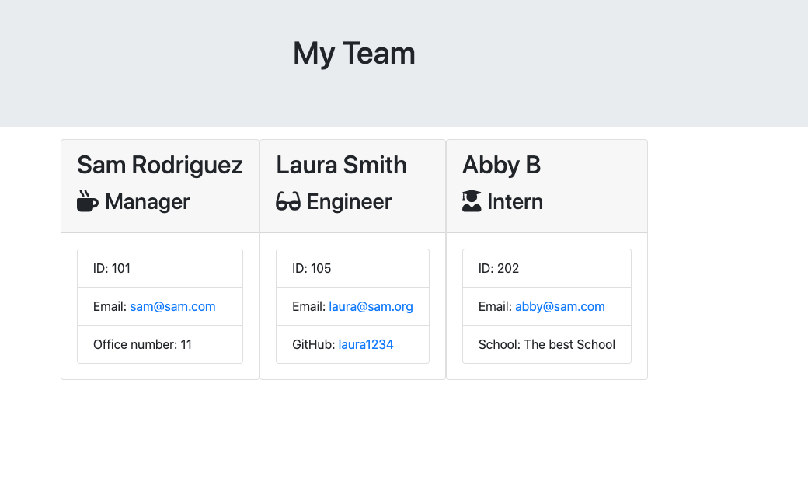
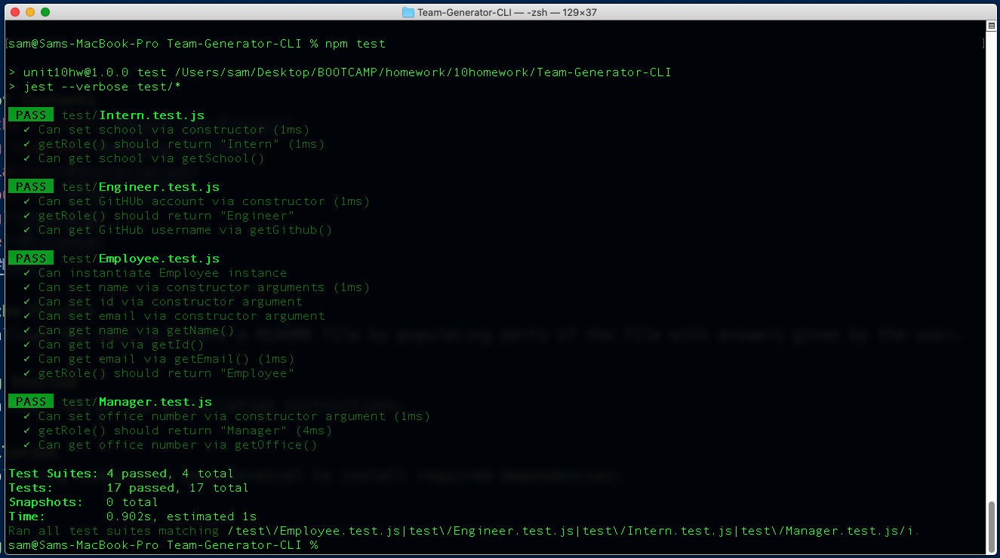
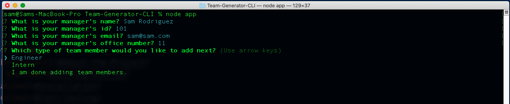
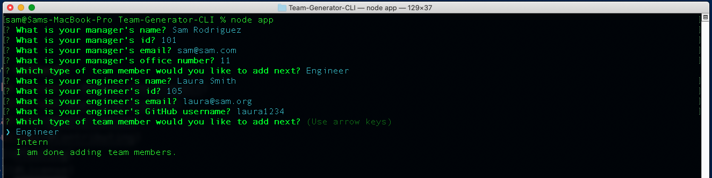
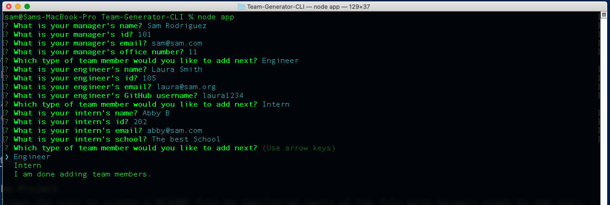

# Team-Generator-CLI

  
  

---

## Table of Contents
- [About the Project](#About-the-Project)
- [Getting Started](#Getting-Started)
- [Installation](#Installation)
- [Contributing](#Contributing)
- [Testing](#Testing)
- [License](#License) 
- [Demo](#Demo)

## About the Project
This app allows the user to build a software engineering team by using a command line application. The application prompts the user for information about the team manager and then information about the team members. The user can input any number of team members, and they may be a mix of engineers and interns.  When the user has completed building the team, the application will create an HTML file that displays a nicely formatted team roster based on the information provided by the user.

## Getting Started  
To get started, follow the Installation instructions.  

### Installation  
Run the following command in your terminal to install required dependencies:  
npm install

## Testing
Run the following command in your terminal to run the tests:  
npm test  
  
After the tests have passed you should see the following results:  

## Contributing
To contribute to this project contact Sam Rodriguez.  
Github Repository URL: https://github.com/samrod777/Team-Generator-CLI  

## License
This application is covered under the MIT license.  

## Demo  
Once all of the dependencies have been installed, the user will be presented with a series of questions for the team manager and the option to choose the next member, as shown below:  
    
  
In this demo the next team member will be an ingeneer; once the user selects the engineer option the following questions will be asked and the option of selecting the next team member will be given:  

  
Lastly the intern option will be selected, and the team  will be completed for this demo.  

For a brief video demo, visit the link below:
https://drive.google.com/file/d/1mCAwQvpLcRLb-Fw2dweF91wpIZrRAeLe/view